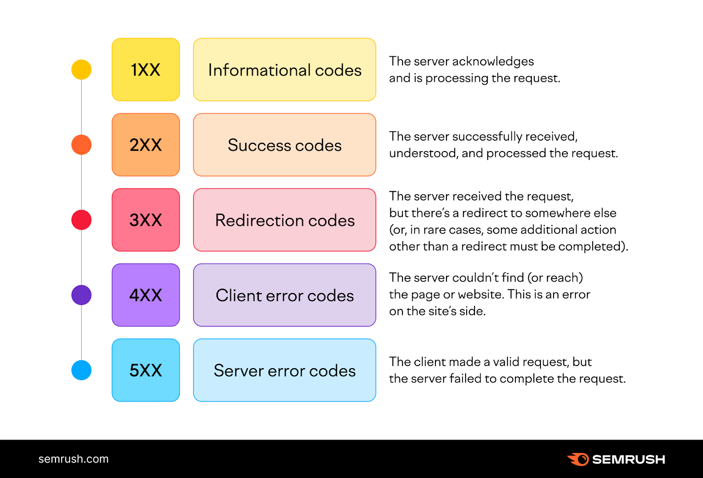

# Welcome to our project !
# We will be building a College system
# I'll keep this file as a log for the learning process while I'm building the project

## Technology
### trying to start using slim php framework
- controllers receive HTTP request, processes them in a proper way and then send the proper HTTP response
- middlewares executes extra logic in the middle of the request and response cycle
  - before or after or between controllers
  - check more [here](https://dev.to/mochafreddo/understanding-the-differences-between-middleware-and-controllers-in-web-development-5ao6)

### figured out I need to set composer up first
1. composer is a dependency management tool, manages dependencies (packages) on a project basis
  - to start composer in you project you use the command `composer init`
  - the `composer.json` file basically is a configuration file. it describes dependencies and some metadata
  - for a package called `monolog/monolog` the first word is the vendor name and the second word is the package name
  - the `composer.lock` file is generated to help you keep the right dependencies and their versions
    - it will help when your colleagues join the project
    - you will be confident they will be working with the right packages and versions
    - generated using the `composer install` or `composer update` commands
    - it MUST be included in you git repo
  - the `/vendor/` directory contains the dependencies them self
    - it MUST be added to the `.gitignore` file

2. composer is also a great autoloader
   - it uses a Psr-4 autoloader
   - it maps a namespace to a directory
   - these mappings are generated in `composer.json` and I believe they are executed from a file called `autoload_psr4.php` that can be found in composer's configuration files
   - you have to require `projectBasePath/vendor/autoload.php` at the very top of the application entry point so that you can utilize composer's autoloading

### I think I should read more about Psr //TODO
### you can also use phpStorm or other plugins that help with psr

### php is automatically set to version 5.6, why ? and how to specify the php version of this project ??
1. turns out this was phpStorm's interpreter that was set to version 5.6
2. I found out that I can overwrite the php.ini file and specify the version, or I can require php in the `composer.json` file with the version I want
3. at the end the version installed on my machine (8.2) was used because I used the php's built-in server, ran `php -S localhost:8888` command in the terminal

### back to slim framework
- slim uses psr7 interfaces for its request and response objects
- the args array at controller function definition is an array of route parameters
- I'll skim through slim's documentation and be back
- I'll also use the help of this great php [playlist](https://www.youtube.com/playlist?list=PLr3d3QYzkw2xabQRUpcZ_IBk9W50M9pe-)
- also the help of the MDN documents

### Entities (PDO, DBAL, Doctrine ORM)
- I need to connect to the DB
- **added .env file and downloaded the `vlucas/phpdotenv` package**
- PHP Data Object (PDO) is a "data access layer"
- while DataBase Abstraction Layer (DBAL) is an abstraction layer as the name says, which is more useful
- we also use "doctrine ORM", while ORM stands for object relational mapping
  - ORM is a technique to convert data between incompatible types using OOP
  - this creates the effect of a virtual object database that can be used from within the programming language
- I'm not going to create the department entity, faculty is enough for sake of simplicity 
- got back to my databases reference for ERD symbols and mapping

### ORM
- start [here](https://www.doctrine-project.org/projects/doctrine-orm/en/3.2/tutorials/getting-started.html)
- ORM can use attributes or XML tags to specify its metadata
- all attributes [here](https://www.doctrine-project.org/projects/doctrine-orm/en/3.2/reference/attributes-reference.html)
- unit of work is an object-based transaction, it starts by the initialization of the entity manager and ends by calling entityManager#flush
- unit of work stores all persisted changes and executes them once for efficiency’s sake
- the bigger the unit of work gets, the heavier the execution becomes.
- the entity manager is considered the entry point for ORM
- entities have four states: new, managed, detached, removed
- more working with objects [here](https://www.doctrine-project.org/projects/doctrine-orm/en/3.2/reference/working-with-objects.html)
- entity manager needs both a connection and a configuration objects to be initialized
- run `composer require doctrine/migrations`
- migrations configuration (go to the advanced section to set up using entity manager) [here](https://www.doctrine-project.org/projects/doctrine-migrations/en/3.8/reference/configuration.html#advanced)
- there was an issue with the course referencing its own attribute
- for decimal data type, precision is the number of digits left to the floating point, and scale is the number of digits to the right of the floating point

## HTTP (conceptual)
- refer to MDN [GLOSSARY](https://developer.mozilla.org/en-US/docs/Glossary) when you need
- HTTP stands for hyper text transfer protocol
- this protocol is what powers the world wide web
- this protocol is used in the application layer of the OSI network model
- the client opens the connection and makes a request while the server sends the response
- [difference between webpages, websites, webservers, and search engines](https://developer.mozilla.org/en-US/docs/Learn/Common_questions/Web_mechanics/Pages_sites_servers_and_search_engines)

### HTTP is a stateless protocol
Neither the server nor the client remember previous communications. For example, relying on HTTP alone, a server can't remember a password you typed or remember your progress on an incomplete transaction. You need an application server (backend) for tasks like that.

### HTTP status codes

### HTTP Session
- HTTP is a client-server protocol
- the client is the one that starts the connection
- client sends a request and the server replies back with a response
- both the request and the response has there structure and headers
- there are representation headers also that are used to specify the format / MIME type and encoding of data

### MIME types
- MIME stands for "Multipurpose Internet Mail Extensions"
- MIME types are often called "media types" nowadays
- `text/plain` which is a textual file & `application/octet-stream` a binary file, are the most important MIME types.
- check more media types [here](https://developer.mozilla.org/en-US/docs/Web/HTTP/Basics_of_HTTP/MIME_types/Common_types)

### Cross Origin Resource Sharing (CORS)
- CORS is an HTTP header based mechanism that allows the server to indicate extra origins to load resources from other than the server's own domain
- Example:
  - if I'm in domain-A and sent a request for a resource from domain-B
  - if domain-B allows domain-A to load resources from it, domain-A will be abel to do so
  - on the other hand: if domain-B doesn't allow 
##### pre-flight mechanism: it's a mechanism used to check if the actual request is safe to send or not
  - it's an HTTP OPTIONS request that's sent by the browser, the server responds whether the actual request is safe to send or not
  - if the actual request is safe to send, then the browser sends it
  - this mechanism has some conditions to be triggered
  - as you noticed, this is an intermediary mechanism that does not transport any data, so we need to make these requests as light as possible so that we give the true performance to the actual requests

## dependency injection (conceptual)
- it's straightforward; instead of class X initializing its dependencies to start using them, class X received its dependencies in the constructor
- dependency injection is a way to apply inversion of control in OOP 
- inversion of control provides separation of logic, code reusability, loose coupling, and easier testing. It leads to a modular code
- one of inversion of control downsides is Glue code, dependencies depending on other dependencies depending on other dependencies and so on.

### DI scenario
- I use request validator classes to validate the upcoming request
- some request validators use the entity manager which is injected in the constructor and should be handled by the DI container
- I need to initialize the request validator in the controller, but I'm asked to provide the entity manager
- I also don't want the controller to access the entity manager, so I use the FACTORY DESIGN PATTERN

## server-side programming (MDN Docs)
- [start reading](https://developer.mozilla.org/en-US/docs/Learn/Server-side)
- Getting started with server-side programming is usually easier than client-side development, because dynamic websites tend to perform a lot of very similar operations (retrieving data from a database and displaying it in a page, validating user-entered data and saving it in a database, checking user permissions and logging users in, etc.), and are constructed using web frameworks that make these and other common web server operations easy.
- there are two types of servers
  - static server: delivers the web docs as-is
  - dynamic server: a static web server + extra software (backend software) + database
-----------------------------------------------
### need to (study / revise) stack
- MVC pattern
- cookies and their management
- web socket
- web infrastructure
- CSRF
- XSS
